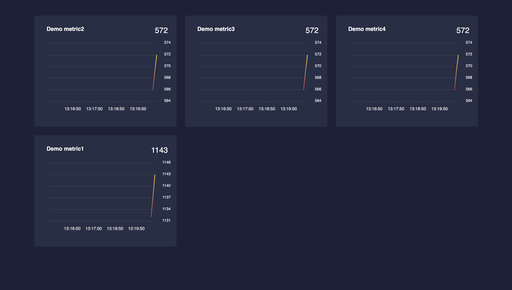

# metrics-dashboard-rs

[](https://crates.io/crates/metrics-dashboard)
[](https://docs.rs/metrics-dashboard)
[](https://github.com/giangndm/metrics-dashboard-rs/actions)

This crate provide simple auto-generate dashboard for [metric-rs](https://crates.io/crates/metrics) crate.

## Screenshot



## How to use

* run `cargo add metrics-dashboard`
* include into poem webserver like bellow:

```rust
use std::time::Duration;

use metrics_dashboard::build_dashboard_route;
use metrics::{describe_counter, increment_counter};
use poem::{
    get, handler, listener::TcpListener, middleware::Tracing, web::Path, EndpointExt, Route, Server,
};

#[handler]
fn hello(Path(name): Path<String>) -> String {
    format!("hello: {name}")
}

#[tokio::main]
async fn main() -> Result<(), std::io::Error> {
    if std::env::var_os("RUST_LOG").is_none() {
        std::env::set_var("RUST_LOG", "poem=debug");
    }
    tracing_subscriber::fmt::init();

    let app = Route::new()
        .at("/hello/:name", get(hello))
        .nest("/dashboard/", build_dashboard_route())
        .with(Tracing);

    tokio::spawn(async move {
        describe_counter!("demo_metric1", "Demo metric1");
        loop {
            tokio::time::sleep(Duration::from_secs(1)).await;
            increment_counter!("demo_metric1");
        }
    });

    Server::new(TcpListener::bind("0.0.0.0:3000"))
        .name("hello-world")
        .run(app)
        .await
}
```

## License

Licensed under ([LICENSE-MIT](LICENSE-MIT) or http://opensource.org/licenses/MIT)

## Contribution

Unless you explicitly state otherwise, any contribution intentionally submitted
for inclusion in the work by you, as defined in the MIT license, without any additional terms or conditions.

See [CONTRIBUTING.md](CONTRIBUTING.md).
